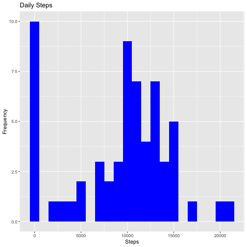
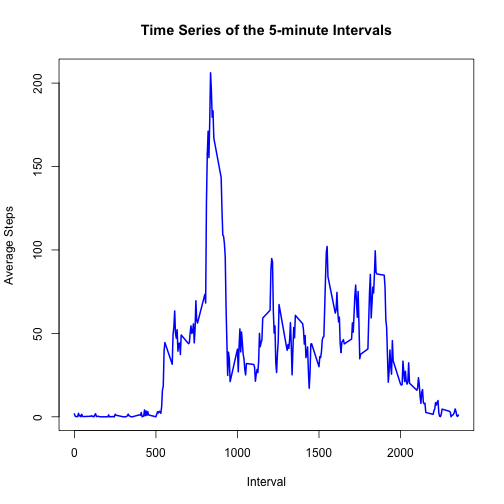
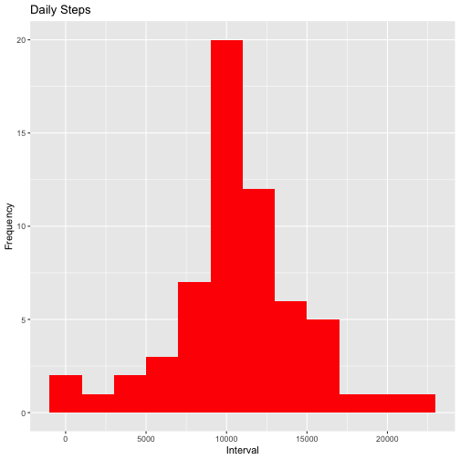
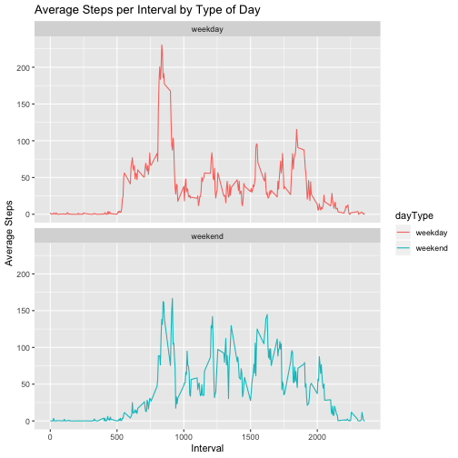

## Loading and preprocessing the data

```r
activity <- read.csv("activity.csv",stringsAsFactors=FALSE)
```

Quick check of the data

```r
str(activity)
```

```
## 'data.frame':	17568 obs. of  3 variables:
##  $ steps   : int  NA NA NA NA NA NA NA NA NA NA ...
##  $ date    : chr  "2012-10-01" "2012-10-01" "2012-10-01" "2012-10-01" ...
##  $ interval: int  0 5 10 15 20 25 30 35 40 45 ...
```


```r
summary(activity)
```

```
##      steps            date              interval     
##  Min.   :  0.00   Length:17568       Min.   :   0.0  
##  1st Qu.:  0.00   Class :character   1st Qu.: 588.8  
##  Median :  0.00   Mode  :character   Median :1177.5  
##  Mean   : 37.38                      Mean   :1177.5  
##  3rd Qu.: 12.00                      3rd Qu.:1766.2  
##  Max.   :806.00                      Max.   :2355.0  
##  NA's   :2304
```


Load Packages

```r
library(dplyr)
library(ggplot2)
library(lubridate)
```

## 1. What is mean total number of steps taken per day?

Group by date

```r
activity1 <- activity %>%
        group_by(date) %>%
        summarise(daily = sum(steps, na.rm=TRUE))
```
Check the data

```r
head(activity1)
```

```
## # A tibble: 6 x 2
##   date       daily
##   <chr>      <int>
## 1 2012-10-01     0
## 2 2012-10-02   126
## 3 2012-10-03 11352
## 4 2012-10-04 12116
## 5 2012-10-05 13294
## 6 2012-10-06 15420
```
Create a histogram of the total number of steps taken per day

```r
ggplot(activity1, aes(x = daily)) +
    geom_histogram(fill = "blue",binwidth=1000) +
    labs(title = "Daily Steps", x = "Steps", y = "Frequency")
```




```r
theMean   <- mean(activity1$daily,na.rm=TRUE)
theMean
```

```
## [1] 9354.23
```

```r
theMedian <- median(activity1$daily,na.rm=TRUE)
theMedian
```

```
## [1] 10395
```

The mean of the steps is 9354.2295082.   
The median of the steps is 10395  


## 2. What is the average daily activity pattern?

Group the data by 5-minute intervals

```r
activity2 <- activity %>%
        group_by(interval) %>%
        summarise(meanSteps = mean(steps,na.rm=TRUE))
```

Check what I have

```r
head(activity2)
```

```
## # A tibble: 6 x 2
##   interval meanSteps
##      <int>     <dbl>
## 1        0    1.72  
## 2        5    0.340 
## 3       10    0.132 
## 4       15    0.151 
## 5       20    0.0755
## 6       25    2.09
```


```r
with(activity2, plot(interval,meanSteps, type="l",lty=1,lwd=2,col="blue",
     ylab="Average Steps", xlab="Interval",
     main="Time Series of the 5-minute Intervals"))
```




```r
intervalwithMax <- activity2  %>% 
       filter(meanSteps == max(activity2$meanSteps)) %>% 
        pull(interval)
intervalwithMax
```

```
## [1] 835
```

The interval with maximum average number of the steps is 835.  


## 3. Imputing missing values
Detemine how many rows have NA

```r
totNAs <-sum(is.na(activity$steps))
```
There are 2304 rows with missing values.

Replace the missing values with the average for the interval. This was calculated 
in step 2 and is in dataframe activity2.


```r
activity3 <- activity %>%
        left_join(activity2) %>%
        mutate(newSteps = ifelse (is.na(steps), meanSteps, steps))
```

```
## Joining, by = "interval"
```

```r
head(activity3)
```

```
##   steps       date interval meanSteps  newSteps
## 1    NA 2012-10-01        0 1.7169811 1.7169811
## 2    NA 2012-10-01        5 0.3396226 0.3396226
## 3    NA 2012-10-01       10 0.1320755 0.1320755
## 4    NA 2012-10-01       15 0.1509434 0.1509434
## 5    NA 2012-10-01       20 0.0754717 0.0754717
## 6    NA 2012-10-01       25 2.0943396 2.0943396
```

Group and total the data, and plot

```r
activity4 <- activity3 %>%
        group_by(date) %>%
        summarise(daily = sum(newSteps))

ggplot(activity4, aes(x = daily)) +
    geom_histogram(fill = "red",binwidth=2000) +
    labs(title = "Daily Steps", x = "Interval", y = "Frequency")
```




```r
theMean2   <- mean(activity4$daily)
theMean2
```

```
## [1] 10766.19
```

```r
theMedian2 <- median(activity4$daily)
theMedian2
```

```
## [1] 10766.19
```
  
###Summarise the Mean and Median results
  
Version | Mean  | Median
--- | --- | ---
With NAs | 9354.2295082 | 10395
NAs replaced by interval mean| 1.0766189 &times; 10<sup>4</sup> | 1.0766189 &times; 10<sup>4</sup>
  
Both the mean and median have increased slightly by replacing the NAs, which is 
expected.
  
## Are there differences in activity patterns between weekdays and weekends?

```r
activity5 <- activity3 %>%
        mutate(dayType = 
                as.factor
                (ifelse ((wday(as.Date(date, format = "%Y-%m-%d")) %in% c(7,1)), 
                        "weekend", 
                        "weekday")))
head(activity5)
```

```
##   steps       date interval meanSteps  newSteps dayType
## 1    NA 2012-10-01        0 1.7169811 1.7169811 weekday
## 2    NA 2012-10-01        5 0.3396226 0.3396226 weekday
## 3    NA 2012-10-01       10 0.1320755 0.1320755 weekday
## 4    NA 2012-10-01       15 0.1509434 0.1509434 weekday
## 5    NA 2012-10-01       20 0.0754717 0.0754717 weekday
## 6    NA 2012-10-01       25 2.0943396 2.0943396 weekday
```


Group the data by 5-minute intervals and plot

```r
activity6 <- activity5 %>%
        group_by(dayType,interval) %>%
        summarise(meanSteps = mean(newSteps))

ggplot(activity6, aes(interval,meanSteps,color=dayType)) + 
        geom_line() + 
        labs(title = "Average Steps per Interval by Type of Day", 
         x = "Interval", y = "Average Steps") + 
        facet_wrap(dayType~., ncol = 1, nrow=2)
```



From this plot we can see that people take more steps earlier on weekdays, but 
then are more stationary during the day. 
On weekends people presumably stay long in bed, but are more active during the
day. They seem to go to bed a little later on weekends than weekdays on this plot.
